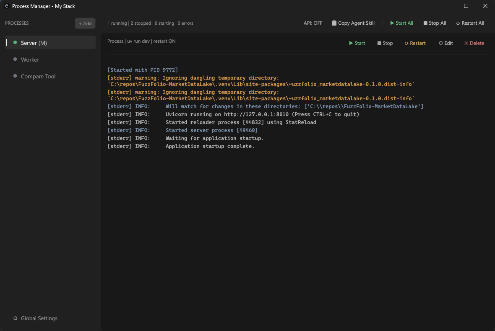

# Simple Rust Process Manager

A fast, no-nonsense process manager built with Rust + Dioxus. Start whole stacks in one click, watch logs live, and actually stop everything cleanly (even messy toolchains like npm/uv). It's small, snappy, and built for real dev workflows.




## Features

- **Process Management**: Start, stop, and restart multiple processes with a single click
- **Real Process Tree Control (Windows)**: Uses Job Objects to kill entire trees so nothing gets orphaned
- **Docker Integration**: Seamlessly control Docker containers alongside regular processes
- **Live Log Streaming**: View real-time output from any managed process
- **Status Monitoring**: Visual indicators show running/stopped state for each process
- **Error Attention**: Flashes the taskbar icon on new errors when the app is unfocused
- **Portable Configuration**: JSON config file lives next to the executable for easy portability
- **Global Controls**: Start All, Stop All, Restart All buttons for quick environment setup
- **Graceful Shutdown**: Regular processes are killed on app close; Docker containers persist

## Installation

### From Source

```bash
# Clone the repository
git clone https://github.com/yourusername/simple-rust-process-manager.git
cd simple-rust-process-manager

# Build release version
cargo build --release

# The executable will be at target/release/simple-rust-process-manager.exe (Windows)
# or target/release/simple-rust-process-manager (Linux/macOS)
```

### Pre-built Binaries

Check the [Releases](https://github.com/yourusername/simple-rust-process-manager/releases) page for pre-built binaries.

## Usage

1. **First Run**: Launch the executable. If no `processes.json` exists next to it, one will be created automatically.

2. **Adding Processes**: Click the "+" button to add a new process entry. Fill in:
   - **Name**: A friendly name for the process
   - **Command**: The command to run (e.g., `npm run dev`, `uv run dev`)
   - **Working Directory**: Where to run the command from
   - **Type**: Either "Process" or "Docker"

3. **Managing Processes**:
   - Click on a process in the left sidebar to view its logs
   - Use the play/stop/restart buttons on each process card
   - Use global controls in the header for batch operations

4. **Docker Containers**: For Docker entries, specify the container name. The manager will use `docker start/stop/restart` commands.

## Command Notes (Direct Spawn)

Commands are executed directly (no shell), which keeps process IDs tight and makes stop/kill reliable.  
That also means shell operators like `&&`, `|`, `>` aren't supported in the command box. If you need them, wrap the logic in a `.cmd`/`.bat`/`.ps1` or a script and call that script instead.

## Configuration

The `processes.json` file structure:

```json
{
  "processes": [
    {
      "id": "uuid-here",
      "name": "Frontend Dev Server",
      "command": "npm run dev",
      "working_directory": "C:/projects/my-app/frontend",
      "process_type": "Process",
      "auto_start": false
    },
    {
      "id": "uuid-here",
      "name": "PostgreSQL",
      "command": "my-postgres-container",
      "working_directory": "",
      "process_type": "Docker",
      "auto_start": false
    }
  ]
}
```

## Keyboard Shortcuts

| Shortcut | Action |
|----------|--------|
| `Ctrl+N` | Add new process |
| `Ctrl+S` | Start all processes |
| `Ctrl+X` | Stop all processes |
| `Ctrl+R` | Restart all processes |

## Development

```bash
# Run in development mode with hot reload
cargo run

# Run tests
cargo test

# Build release
cargo build --release
```

## Architecture

- **Dioxus Desktop**: Native GUI framework for Rust
- **Tokio**: Async runtime for process management
- **Serde**: JSON serialization for config persistence
- **portable-pty**: Cross-platform PTY support for log streaming

## License

MIT License - feel free to use this for any purpose.

## Donations & Support

If this saves you time or pain, you can support the work here:

- Patreon (recurring)
- GitHub Sponsors (recurring)
- PayPal (one-time)

Links:
- https://www.patreon.com/EnviralDesign
- https://github.com/sponsors/EnviralDesign
- https://www.paypal.com/donate?hosted_button_id=RP8EJAHSDTZ86

## Contributing

Contributions welcome! Please open an issue or PR.
