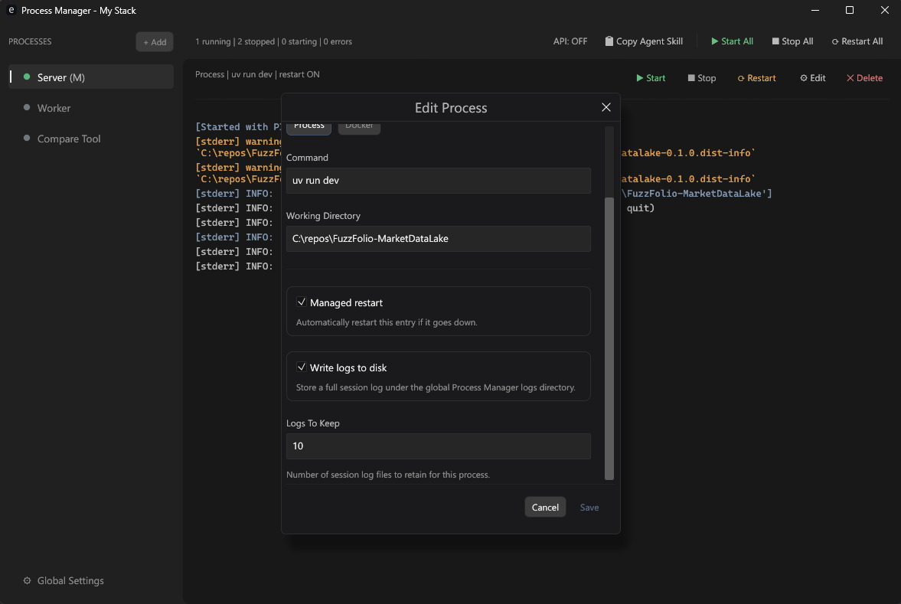
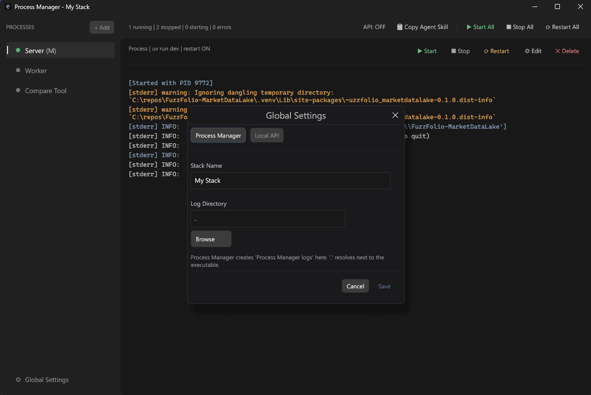
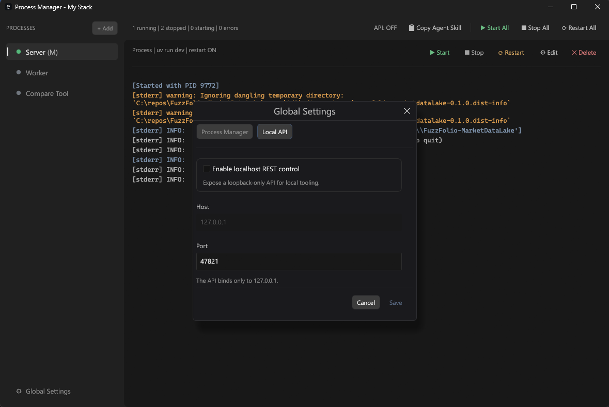

# Simple Rust Process Manager

A native desktop process manager for developers who want one place to run a stack, watch logs, restart flaky services, and stop everything cleanly.

It is built for the annoying real-world cases:

- mixed stacks like `npm`, `uv`, scripts, and Docker containers
- runaway child processes that do not die when the parent exits
- local tools that need a loopback API for agents, scripts, or automation
- dev environments where fast feedback matters more than infrastructure theater


## Why Use It

- Start your full local stack from one UI instead of juggling terminals.
- Watch live output for the selected process without leaving the app.
- Auto-start only the processes you opt into when the manager itself launches.
- Restart unstable services automatically with per-process managed restart.
- Stop process trees cleanly on Windows, including messy child-process chains.
- Mix normal commands and Docker containers in the same stack.
- Expose an optional localhost-only REST API for tooling and AI agents.

## What It Looks Like

### Main Workspace

The main view is built for daily use: left-side process list, top-level stack controls, and live logs for the selected process.


Highlights visible here:

- `(M)` marks entries with managed restart enabled
- `(A)` marks entries that auto-start when the app launches
- `Start All`, `Stop All`, and `Restart All` control the whole stack
- the selected process shows live output with warning/error color differentiation
- the header can expose a loopback API and copy an agent bootstrap payload

### Edit Process

Each process entry can be updated in place. You do not need to delete and recreate it to change behavior.



This screen covers:

- command and working directory changes
- process vs Docker mode
- auto-start with app launch
- managed restart
- disk log capture and retention

### Global Settings: Process Manager

Stack-wide settings stay out of the way but are easy to find.



This panel controls:

- stack name
- shared log directory
- portable layout for logs next to the executable when desired

### Global Settings: Local API

The app can optionally expose a loopback-only control surface for local tooling.



This panel controls:

- localhost REST enable/disable
- port selection
- agent/tooling access without exposing the service on the network

## Core Functionality

### Stack Control

- Start, stop, and restart the whole stack from the header.
- Start, stop, restart, edit, or delete individual entries from the process pane.
- Keep a mixed stack of regular commands and Docker containers in one place.

### Live Logs

- Stream output for the selected process in real time.
- Visually differentiate system events, warnings, errors, and normal output.
- Keep the log view pinned to the bottom while new lines arrive.

### Resilience

- Enable managed restart per entry for processes that should come back automatically.
- Enable auto-start per entry when you want the stack to come up automatically after Process Manager launches.
- On Windows, stop entire process trees with Job Objects so children are not orphaned.
- Keep Docker behavior explicit: regular processes are shut down on app close, containers persist unless you stop them.

### Configuration Without Friction

- Store config in a portable `processes.json` next to the executable.
- Edit existing entries in place.
- Persist logs to disk per process, with configurable retention.
- Migrate older config files forward automatically.

### Tooling and Automation

- Enable a localhost-only REST API for scripts, dashboards, and agents.
- Copy an agent bootstrap block that includes host, port, endpoints, and process ids.
- Use stable process ids for reliable external control.

## Quick Start

### From Source

```bash
git clone https://github.com/EnviralDesign/simple-rust-process-manager.git
cd simple-rust-process-manager
cargo build --release
```

Output binary:

- Windows: `target/release/simple-rust-process-manager.exe`
- Linux/macOS: `target/release/simple-rust-process-manager`

### Prebuilt Binaries

See the [Releases](https://github.com/EnviralDesign/simple-rust-process-manager/releases) page.

## Basic Workflow

1. Launch the app. If `processes.json` does not exist next to the executable, it will be created.
2. Click `Add` to create a process entry.
3. Choose a type:
   - `Process` for normal commands like `npm run dev` or `uv run dev`
   - `Docker` for container names controlled through Docker
4. Optionally enable:
   - auto-start with app launch
   - managed restart
   - disk logging
5. Select a process in the left sidebar to watch its logs.
6. Use stack-wide controls in the header when you want to bring everything up or down together.

## Command Model

Commands are spawned directly, not through a shell.

Why that matters:

- process IDs stay tighter and cleanup is more reliable
- stop/kill behavior is more predictable
- shell operators like `&&`, `|`, and `>` are not supported directly in the command field

If you need shell composition, wrap it in a script such as `.cmd`, `.bat`, `.ps1`, or another executable entrypoint and run that instead.

## Configuration

The app stores configuration in `processes.json`.

Example:

```json
{
  "stack_name": "My Stack",
  "remote_control": {
    "enabled": false,
    "port": 47821
  },
  "log_directory": ".",
  "processes": [
    {
      "id": "uuid-here",
      "name": "Frontend Dev Server",
      "command": "npm run dev",
      "working_directory": "C:/projects/my-app/frontend",
      "process_type": "Process",
      "auto_start": false,
      "auto_restart": true,
      "log_to_disk": true,
      "log_rotation_count": 10
    },
    {
      "id": "uuid-here",
      "name": "PostgreSQL",
      "command": "my-postgres-container",
      "working_directory": "",
      "process_type": "Docker",
      "auto_start": false,
      "auto_restart": false,
      "log_to_disk": false,
      "log_rotation_count": 10
    }
  ]
}
```

Notes:

- `log_directory` is the shared base folder for persisted logs
- `.` resolves next to the executable
- older config versions are migrated automatically on startup

## Local REST API

When enabled, the manager starts a loopback-only HTTP server on `127.0.0.1:{port}`.

Read endpoints:

- `GET /health`
- `GET /processes`
- `GET /processes/{id}`
- `GET /processes/{id}/logs?limit=N`
- `GET /topology`

Control endpoints:

- `POST /stack/start`
- `POST /stack/stop`
- `POST /stack/restart`
- `POST /processes/{id}/start`
- `POST /processes/{id}/stop`
- `POST /processes/{id}/restart`

Notes:

- the API binds only to `127.0.0.1`
- use process `id`, not display name, for per-process actions
- `GET /processes/{id}/logs?limit=N` defaults to `200` and caps at `1000`
- control calls are fire-and-poll; poll `GET /processes` or `GET /health` for updated state

## Keyboard Shortcuts

| Shortcut | Action |
|----------|--------|
| `Ctrl+N` | Add new process |
| `Ctrl+S` | Start all processes |
| `Ctrl+X` | Stop all processes |
| `Ctrl+R` | Restart all processes |

## Development

```bash
cargo run
cargo test
cargo build --release
```

## Stack

- `Rust`: application code and native desktop packaging
- `egui` / `eframe`: immediate-mode desktop UI
- `Tokio`: async runtime and background orchestration
- `Serde`: config persistence
- `portable-pty`: process output capture
- `Axum`: optional localhost REST API

## License

MIT

## Donations & Support

If this saves you time, you can support the work here:

- [Patreon](https://www.patreon.com/EnviralDesign)
- [GitHub Sponsors](https://github.com/sponsors/EnviralDesign)
- [PayPal](https://www.paypal.com/donate?hosted_button_id=RP8EJAHSDTZ86)

## Contributing

Issues and PRs are welcome.
