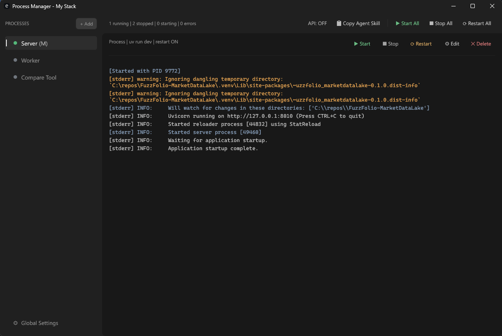
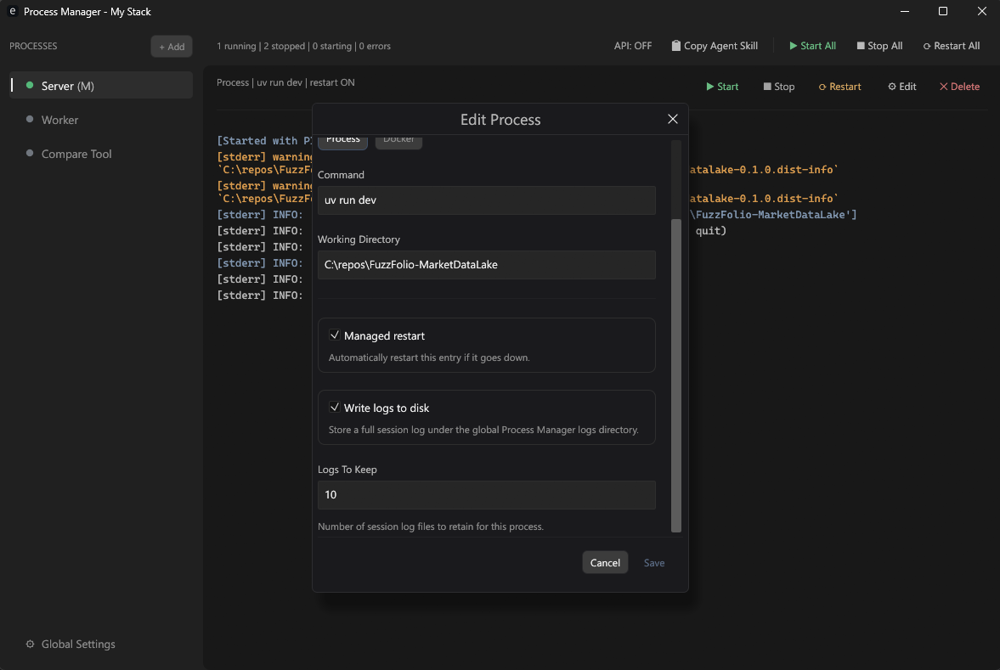
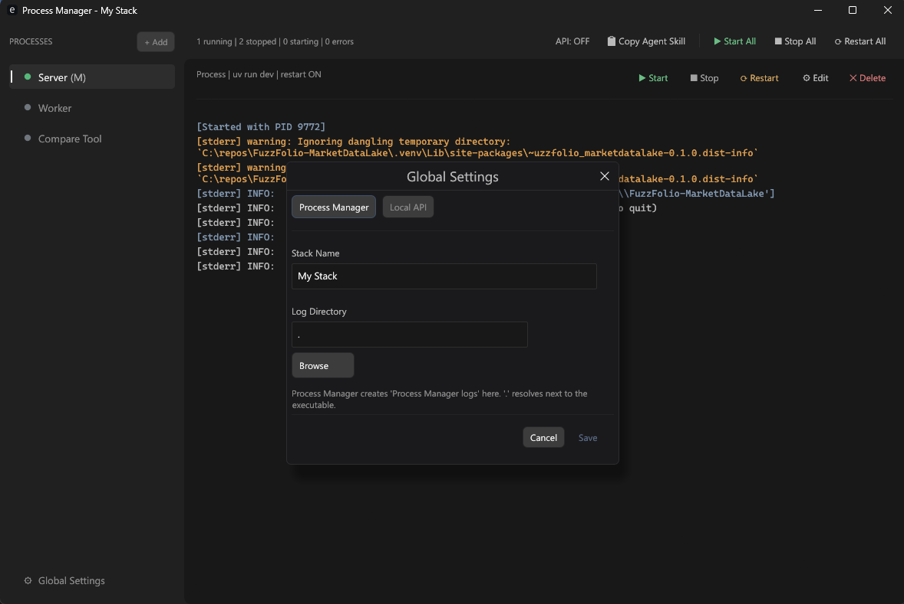
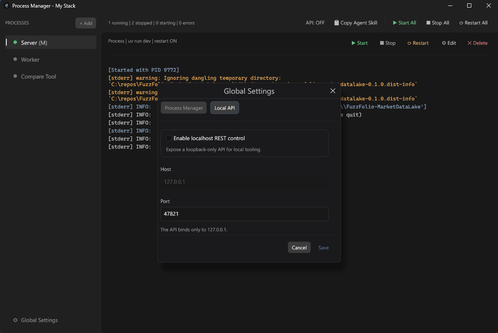

# Simple Rust Process Manager

A native desktop process manager for developers who want one place to run a stack, watch logs, restart flaky services, and stop everything cleanly.

It is built for the annoying real-world cases:

- mixed stacks like `npm`, `uv`, scripts, and Docker containers
- runaway child processes that do not die when the parent exits
- local tools that need a loopback API for agents, scripts, or automation
- dev environments where fast feedback matters more than infrastructure theater


## Why Use It

- Start your full local stack from one UI instead of juggling terminals.
- Watch live output for the selected process without leaving the app.
- Auto-start only the processes you opt into when the manager itself launches.
- Restart unstable services automatically with per-process managed restart and optional active hours.
- Start dormant services from simple per-process schedules.
- Organize related processes into one-layer groups with expand/collapse and aggregate CPU/RAM.
- Stop process trees on Windows and macOS, including child-process chains.
- Mix normal commands and Docker containers in the same stack.
- Expose an optional localhost-only REST API for tooling and AI agents.

## What It Looks Like

### Main Workspace

The main view is built for daily use: left-side process list, top-level stack controls, and live logs for the selected process.



Highlights visible here:

- `(M)` marks entries with managed restart enabled
- `(A)` marks entries that auto-start when the app launches
- `Start All`, `Stop All`, and `Restart All` control entries that opt into each global action
- Shift-select process rows to build one-layer groups; group rows expand/collapse and show aggregate CPU/RAM
- drag any process in the sidebar to reorder it; a live insertion line previews where the row will land when dropped, or use right-click move actions
- the selected process shows live output with warning/error color differentiation
- the header can expose a loopback API and copy an agent bootstrap payload

### Edit Process

Each process entry can be updated in place. You do not need to delete and recreate it to change behavior.



This screen covers:

- command and working directory changes
- process vs Docker mode
- auto-start with app launch
- managed restart with optional active-hours windows
- scheduled start triggers for dormant entries
- Start All / Stop All / Restart All participation
- disk log capture and retention

### Global Settings: Process Manager

Stack-wide settings stay out of the way but are easy to find.



This panel controls:

- stack name
- shared log directory
- portable layout for logs next to the executable when desired

### Global Settings: Local API

The app can optionally expose a loopback-only control surface for local tooling.



This panel controls:

- localhost REST enable/disable
- port selection
- agent/tooling access without exposing the service on the network

## Core Functionality

### Stack Control

- Start, stop, and restart the whole stack from the header.
- Start, stop, restart, edit, or delete individual entries from the process pane.
- Reorder processes from the sidebar by dragging them; while dragging, an insertion line previews the drop position, or use the right-click `Move up` / `Move down` menu.
- Keep one-off/manual entries independent by disabling their Start All, Stop All, and Restart All participation.
- Keep a mixed stack of regular commands and Docker containers in one place.

### Groups

- Expand and collapse group rows to keep long stacks readable.
- See aggregate CPU/RAM for each group row at a glance.
- Start, stop, or restart a group through the UI or the REST API; each action honors its members' matching stack-control setting.

### Live Logs

- Stream output for the selected process in real time.
- Visually differentiate system events, warnings, errors, and normal output.
- Keep the log view pinned to the bottom while new lines arrive.
- Click log rows to select whole lines; Shift-click selects a row range for structured copying.
- Double-click a log row to freeze it and enable text selection for that row only; click outside to return to row selection.

### Resilience

- Enable managed restart per entry for processes that should come back automatically.
- Limit managed restart to weekly active-hour windows, with an option to stop the process when a window ends.
- Enable scheduled runs for dormant entries with hourly, every-N-hours, daily, or selected-weekday cadence.
- Enable auto-start per entry when you want the stack to come up automatically after Process Manager launches.
- Disable global Start All, Stop All, or Restart All participation per entry without affecting manual controls, auto-start, or managed restart.
- On Windows, stop process trees with Job Objects. On macOS, each managed command runs in its own process group; stopping sends SIGTERM, then SIGKILL after a one-second grace period. Remaining group members are also cleaned up when the root process exits.
- Keep Docker behavior explicit: regular processes are shut down on app close, containers persist unless you stop them.

### Configuration Without Friction

- Store config in a portable `processes.json` next to the executable, or in Application Support when running a Mac `.app`.
- Edit existing entries in place.
- Edit one-layer groups in the top-level `groups` array alongside `processes`.
- Persist logs to disk per process, with configurable retention.
- Migrate older config files forward automatically.

### Tooling and Automation

- Enable a localhost-only REST API for scripts, dashboards, and agents.
- Copy an agent bootstrap block that includes host, port, endpoints, and process ids.
- Use stable process ids for reliable external control.
- Edit the `groups` array in `processes.json` and call `POST /stack/reload` to apply changes.

## Quick Start

### From Source

```bash
git clone https://github.com/EnviralDesign/simple-rust-process-manager.git
cd simple-rust-process-manager
cargo build --release
```

Output binary:

- Windows: `target/release/simple-rust-process-manager.exe`
- Linux/macOS: `target/release/simple-rust-process-manager`

### Prebuilt Binaries

See the [Releases](https://github.com/EnviralDesign/simple-rust-process-manager/releases) page.

## macOS

Build and run from source with a current stable Rust toolchain and Xcode Command Line Tools:

```sh
cargo run --locked
```

Create a native app and distribution ZIP:

```sh
./scripts/package-macos.sh
open "dist/Process Manager.app"
```

The script produces `dist/Process Manager.app` and a versioned, architecture-specific ZIP. Copy the app to Applications to install it. The bundle declares macOS 12 or newer; the workflow tests current macOS runners, while macOS 12 itself still requires device validation.

When using the app bundle:

- Config: `~/Library/Application Support/Simple Rust Process Manager/processes.json`
- Default logs: `~/Library/Application Support/Simple Rust Process Manager/Process Manager logs/`
- Diagnostics, when enabled: `~/Library/Application Support/Simple Rust Process Manager/process-manager-diagnostics.log`
- Relative log paths resolve from that same configuration directory. Moving/updating the app preserves this data.
- Existing portable configurations can be copied into that directory while the app is closed.
- Finder launches recover PATH from your configured interactive login shell, with Homebrew, `~/.local/bin`, and `~/.cargo/bin` fallbacks. Shell initialization has a three-second timeout. The command field does not expand `$VARIABLE` or `~`; use full paths or an explicit shell when needed.
- Keyboard shortcuts use Command on macOS and Ctrl on Windows.
- CPU/RAM totals include members of the managed process group. CPU percentage is normalized across logical processors, matching Windows.
- Docker Desktop (or another configured Docker engine) must be running for container entries. Containers persist when the app closes, as on Windows.

Process groups cover normal development commands and their descendants. Programs that deliberately detach into a new session/group escape this cleanup; run those in foreground mode. Unlike Windows Job Objects, Unix process groups do not automatically kill children if the manager itself is forcibly killed.

### Intel and universal apps

Install additional targets with rustup when needed:

```sh
rustup target add aarch64-apple-darwin x86_64-apple-darwin
./scripts/package-macos.sh x86_64-apple-darwin
./scripts/package-macos.sh universal
```

Universal packaging builds both architectures and combines them with `lipo`. Native packaging works with Homebrew Rust too; additional targets require a toolchain that supplies their standard libraries.

### Signing and notarization

Local and CI builds use an ad-hoc signature. Public distribution requires your Apple Developer ID Application certificate and notarization credentials. The packaging script supports both using an existing signing identity and a stored `notarytool` keychain profile:

```sh
MACOS_SIGNING_IDENTITY="Developer ID Application: Your Name (TEAMID)" \
MACOS_NOTARY_PROFILE="process-manager" \
./scripts/package-macos.sh
```

The script signs with hardened runtime, submits the app to Apple, staples and validates the ticket, and archives the stapled app. Create the keychain profile using `xcrun notarytool store-credentials` before packaging; credentials stay out of the repository. See [Apple's notarization workflow](https://developer.apple.com/documentation/security/customizing-the-notarization-workflow).

### Automated builds and releases

`.github/workflows/build.yml` tests and packages Windows, Apple Silicon macOS, and Intel macOS for pushes and pull requests. Each job uploads its ZIP. Pushing a `v*` tag assembles the successful builds into a draft GitHub release for review. Mac CI artifacts are ad-hoc signed; run the signing/notarization flow above before public distribution. `Cargo.lock` is committed so these builds use the same dependency versions.

Windows packaging can also be run locally:

```powershell
./scripts/package-windows.ps1
```

## Basic Workflow

1. Launch the app. If `processes.json` does not exist in the configuration directory, it will be created. See the macOS section below for bundled-app paths.
2. Click `Add` to create a process entry.
3. Choose a type:
   - `Process` for normal commands like `npm run dev` or `uv run dev`
   - `Docker` for container names controlled through Docker
4. Optionally enable:
   - auto-start with app launch
   - managed restart
   - managed restart active hours
   - scheduled run
   - Start All / Stop All / Restart All participation
   - disk logging
5. Select a process in the left sidebar to watch its logs.
6. Drag a process in the sidebar, or right-click it, if you want to move it in the list.
7. Use stack-wide controls in the header when you want to bring everything up or down together.

## Command Model

Commands are spawned directly, not through a shell.

Why that matters:

- process IDs stay tighter and cleanup is more reliable
- stop/kill behavior is more predictable
- shell operators like `&&`, `|`, and `>` are not supported directly in the command field

If you need shell composition, wrap it in a script such as `.cmd`, `.bat`, `.ps1`, or `.sh` and run that instead. On macOS, single and double quotes and escaped spaces are supported for arguments. You can also explicitly invoke a shell:

```sh
/bin/zsh -lc 'npm run build && npm run dev'
```

Executable scripts need a shebang and execute permissions, or an explicit interpreter such as `/bin/sh script.sh`.

## Configuration

The app stores configuration in `processes.json`. Portable binaries use the directory beside the executable; the macOS `.app` uses `~/Library/Application Support/Simple Rust Process Manager/`.

Example:

```json
{
  "stack_name": "My Stack",
  "remote_control": {
    "enabled": false,
    "port": 47821
  },
  "log_directory": ".",
  "groups": [
    {
      "id": "uuid-here",
      "name": "Frontend",
      "process_ids": ["uuid-here", "uuid-here"],
      "expanded": true
    }
  ],
  "processes": [
    {
      "id": "uuid-here",
      "name": "Frontend Dev Server",
      "command": "npm run dev",
      "working_directory": "C:/projects/my-app/frontend",
      "process_type": "Process",
      "auto_start": false,
      "startup_delay_seconds": 0,
      "auto_restart": true,
      "restart_schedule": {
        "enabled": true,
        "stop_when_inactive": true,
        "active_hours": [57, 58, 59, 60, 61, 62, 63, 64]
      },
      "respond_to_start_all": true,
      "respond_to_stop_all": true,
      "respond_to_restart_all": true,
      "log_to_disk": true,
      "log_rotation_count": 10
    },
    {
      "id": "uuid-here",
      "name": "PostgreSQL",
      "command": "my-postgres-container",
      "working_directory": "",
      "process_type": "Docker",
      "auto_start": false,
      "startup_delay_seconds": 0,
      "auto_restart": false,
      "respond_to_start_all": true,
      "respond_to_stop_all": true,
      "respond_to_restart_all": true,
      "log_to_disk": false,
      "log_rotation_count": 10
    }
  ]
}
```

Notes:

- `log_directory` is the shared base folder for persisted logs
- `.` resolves beside `processes.json`
- `groups` is a one-layer list of process ids with an `expanded` UI state
- disabled `restart_schedule` and `scheduled_run` blocks are omitted on save; omitted or `null` schedule blocks load as disabled
- `restart_schedule.active_hours` is a sparse list of hourly indices, Monday 00:00 through Sunday 23:00; legacy `restart_schedule.hours` boolean grids still load and compact on save
- `scheduled_run` only starts entries that are not already running; default fields are omitted when possible
- `startup_delay_seconds` waits before honoring any start request for that entry and defaults to `0`
- `respond_to_start_all`, `respond_to_stop_all`, and `respond_to_restart_all` default to `true` for older configs
- older config versions are migrated automatically on startup

## Local REST API

When enabled, the manager starts a loopback-only HTTP server on `127.0.0.1:{port}`.

Read endpoints:

- `GET /health`
- `GET /groups`
- `GET /groups/{id}`
- `GET /processes`
- `GET /processes/{id}`
- `GET /processes/{id}/logs?limit=N`
- `GET /topology`

Control endpoints:

- `POST /stack/start`
- `POST /stack/stop`
- `POST /stack/restart`
- `POST /stack/reload` (reloads `processes.json` from disk and reinitializes the managed set)
- `POST /groups/{id}/start`
- `POST /groups/{id}/stop`
- `POST /groups/{id}/restart`
- `POST /processes/{id}/reload` (reloads one managed process from `processes.json` without stopping others)
- `POST /processes/{id}/start`
- `POST /processes/{id}/stop`
- `POST /processes/{id}/restart`

Notes:

- the API binds only to `127.0.0.1`
- use process `id`, not display name, for per-process actions
- use group `id`, not group name, for per-group actions
- `GET /processes/{id}/logs?limit=N` defaults to `200` and caps at `1000`
- `POST /stack/reload` always stops all managed processes before reload, regardless of their individual `respond_to_*` stack-control flags.
- after editing the `groups` array in `processes.json`, call `POST /stack/reload` to apply the new group layout
- control calls are fire-and-poll; poll `GET /processes` or `GET /health` for updated state

## Keyboard Shortcuts

| Shortcut | Action |
|----------|--------|
| `Ctrl/Command+N` | Add new process |
| `Ctrl/Command+S` | Start all processes |
| `Ctrl/Command+X` | Stop all processes |
| `Ctrl/Command+R` | Restart all processes |
| `Ctrl/Command+C` | Copy selected log rows when row selection is active |
| `Escape` | Clear log row selection |

## Development

```bash
cargo run
cargo test
cargo build --release
```

## Troubleshooting Windows Rendering

If the app feels sluggish on one Windows machine but not another, or it only repaints correctly after switching windows, the issue is usually the graphics backend rather than process management.

Useful launch-time environment overrides:

- `PM_RENDERER=wgpu-dx12` to force DirectX 12
- `PM_RENDERER=wgpu-vulkan` to force Vulkan
- `PM_RENDERER=glow` to use the OpenGL backend
- `PM_VSYNC=false` to disable vsync
- `PM_DIAGNOSTICS=true` to write a diagnostics log next to the executable

Examples in PowerShell:

```powershell
$env:PM_RENDERER = "wgpu-dx12"
.\simple-rust-process-manager.exe
```

```powershell
$env:PM_RENDERER = "glow"
$env:PM_DIAGNOSTICS = "true"
.\simple-rust-process-manager.exe
```

## Stack

- `Rust`: application code and native desktop packaging
- `egui` / `eframe`: immediate-mode desktop UI
- `Tokio`: async runtime and background orchestration
- `Serde`: config persistence
- `portable-pty`: process output capture
- `Axum`: optional localhost REST API

## License

MIT

## Donations & Support

If this saves you time, you can support the work here:

- [Patreon](https://www.patreon.com/EnviralDesign)
- [GitHub Sponsors](https://github.com/sponsors/EnviralDesign)
- [PayPal](https://www.paypal.com/donate?hosted_button_id=RP8EJAHSDTZ86)

## Contributing

Issues and PRs are welcome.
